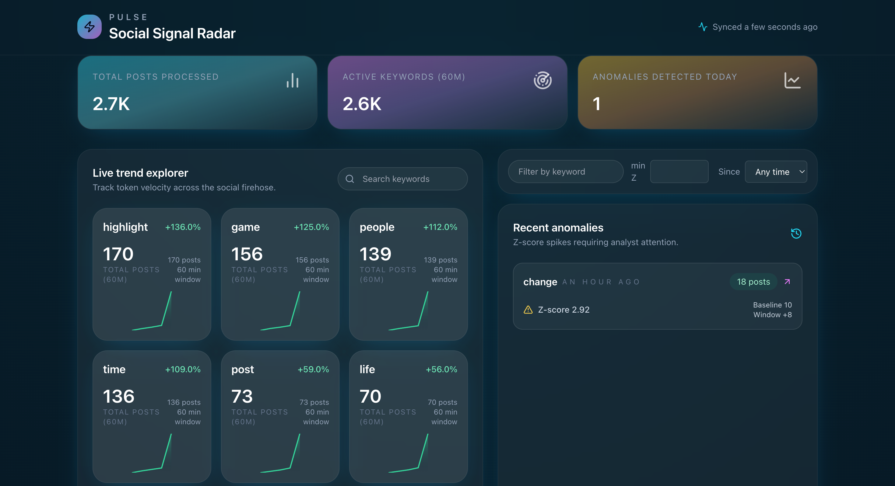

# Pulse: Real-Time Anomaly and Trend Detection System

Modern, end-to-end system for detecting emerging topics and anomalies from social media streams in near real time.

---

## Live Demo

- Web app: https://pulseapp.duckdns.org/

The live dashboard shows:
- Top trending keywords over the last hour
- Volume and sparkline charts for each keyword
- Detected anomalies with z-scores and baseline vs current volume



---

## High-Level Architecture

- **Frontend** (`frontend/pulse-web`)
	- React + TypeScript + Webpack + Tailwind CSS
	- Talks to the API via `/api/*` endpoints and an SSE stream for live anomalies

- **API service** (`backend/pulse-api-service`)
	- Spring Boot REST API exposing `/api/trends`, `/api/anomalies`, and `/api/anomalies/stream`
	- Reads trend data from Redis and anomaly events from Postgres

- **Processing service** (`backend/pulse-processing-service`)
	- Consumes raw social posts from Redis Streams
	- Tokenises text, applies document-frequency (DF) suppression, and maintains a global keyword ZSET in Redis

- **Anomaly service** (`backend/pulse-anomaly-service`)
	- Periodically scans keyword volumes from Redis
	- Computes rolling statistics and z-scores, and persists anomalies to Postgres

- **Ingestion service** (`backend/pulse-ingestion-service`)
	- Python workers for Reddit and synthetic spikes
	- Writes posts into a Redis Stream (`raw_posts`)

- **Data stores**
	- **Redis** (keywords, history, DF counters, raw_posts stream)
	- **Postgres** (persistent anomaly events for the dashboard)

---

## Tech Stack

- **Frontend**: React 18, TypeScript, Tailwind CSS, Webpack 5
- **Backend**: Spring Boot 3 (Java 21), Redis Streams, PostgreSQL, JPA/Hibernate
- **Ingestion**: Python 3, Reddit API / synthetic generators
- **Infrastructure**: OCI VMs, Caddy or Nginx reverse proxy, DuckDNS for TLS

---

## Running Locally (Quickstart)

From the repo root `Pulse/`:

### 1. Start dependencies (Redis + Postgres)

Using the provided Docker compose for local development:

```bash
cd infra/oracle
docker compose up -d redis postgres
```

This will expose:
- Redis on `localhost:6379`
- Postgres on `localhost:5432` (user: `pulse`, password: `pulse`, db: `pulse`)

### 2. Start backend services

All commands below assume Java 21 and Maven are installed.

#### Processing service

```bash
cd backend/pulse-processing-service
mvn -DskipTests clean package spring-boot:repackage
java -jar target/pulse-processing-service-0.0.1-SNAPSHOT.jar \
	--spring.profiles.active=redis-pipeline \
	--spring.data.redis.host=localhost \
	--spring.data.redis.port=6379 \
	--server.port=8084
```

#### Anomaly service

```bash
cd backend/pulse-anomaly-service
mvn -DskipTests clean package spring-boot:repackage
java -jar target/pulse-anomaly-service-0.0.1-SNAPSHOT.jar \
	--spring.profiles.active=redis-pipeline \
	--spring.data.redis.host=localhost \
	--spring.data.redis.port=6379 \
	--spring.datasource.url=jdbc:postgresql://localhost:5432/pulse \
	--spring.datasource.username=pulse \
	--spring.datasource.password=pulse \
	--spring.jpa.hibernate.ddl-auto=update \
	--server.port=8085
```

#### API service

```bash
cd backend/pulse-api-service
mvn -DskipTests clean package spring-boot:repackage
java -jar target/pulse-api-service-0.0.1-SNAPSHOT.jar \
	--spring.profiles.active=redis-pipeline \
	--spring.data.redis.host=localhost \
	--spring.data.redis.port=6379 \
	--spring.datasource.url=jdbc:postgresql://localhost:5432/pulse \
	--spring.datasource.username=pulse \
	--spring.datasource.password=pulse \
	--spring.jpa.hibernate.ddl-auto=update \
	--server.port=8086
```

### 3. Start ingestion

```bash
cd backend/pulse-ingestion-service
python3 -m venv .venv
source .venv/bin/activate
pip install -r requirements.txt

# Example: start Reddit ingestion (requires Reddit API credentials in .env)
python reddit_ingest.py

# Or use the synthetic spike generator to demo anomalies
python spike_redis.py --keyword demofire --pulses 5 --posts-per-pulse 10 --spike-posts 500 --show-z
```

### 4. Start the frontend

```bash
cd frontend/pulse-web
npm install
npm run dev
```

By default the dev server runs on `http://localhost:5176` and proxies API calls to whatever origin you configure via `TRENDS_API_URL` (or falls back to the same origin).

---

## Deployment Notes (OCI / DuckDNS)

- Public VM hosts:
	- Caddy or Nginx reverse proxy
	- All three Spring Boot services (processing, anomaly, api)
	- Frontend static assets (built `pulse-web`)
- Private VM hosts:
	- Redis
	- Postgres (via Docker)

Key ideas:
- The reverse proxy terminates TLS for `https://pulseapp.duckdns.org/`.
- The frontend calls `/api/*`; the proxy forwards those requests to the API service (e.g., `localhost:8086`) on the public VM.
- Spring services connect to Redis and Postgres on the private VM over the internal network.

---

